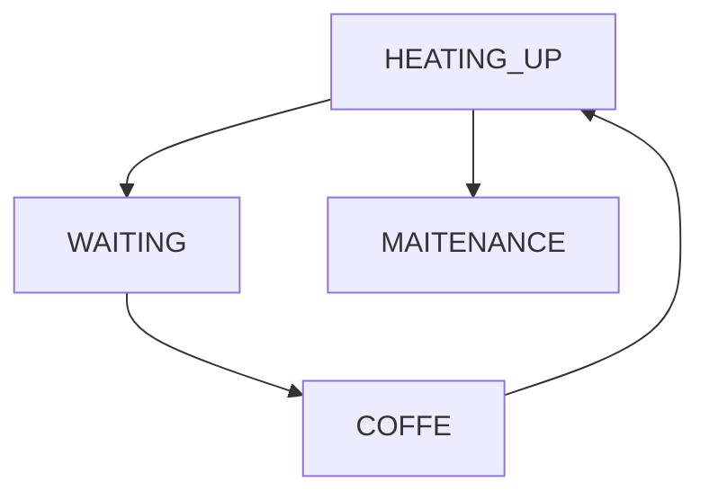
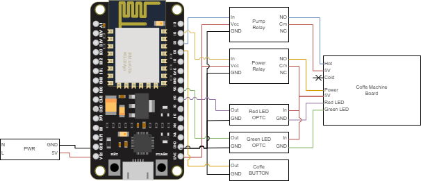

# KRUPS Piccolo ESPHome
 - ESPHome based controller for dolce gusto (krups) piccolo coffer machine
 - Control coffe machine remotely
   - Turn on/off
   - Keep track of the machine state
   - Start maitenance procedure
   - Start and stop coffe automatically
     - Short press for expresso
     - Long press for large coffe
 - State machine implemented to control the machine

 

## Material
 - ESP board (code uses NodeMCU board w/ ESP8266)
   - Any board will do
 - Two relays (board)
   - Control pump
   - Turn on/off
 - Optocoupler PC817 board (2 inputs)
   - Status LED's (Green and Red)
   - Read machine status
   - Detect maitenance
 - Button (any small button will do)
   - Preferably one that can be easily attached to the machine shell
   - Press for short coffe
   - Long press for large coffe

## Installation 
 - Install ESPHome Builder in HAOS
 - Setup ESP8266 or ESP32 board and take note of the encryption and OTA keys
 - Copy the `coffe.yaml` code to your file.
   - Replace keys
 - Compile and install.

## Coffe Machine Control board
 - The control board of the machine is well labeled
 - NCT (Temperature sensor)
   - Not Used for this project
 - MMI (Button and Leds)
   - Red LED (GND)
   - On/Off Button (Activated w/ 5V) 
   - 5V
   - Green LED (GND)
 - V. Det (Pump Control)
   - Cold (Activated /w 5V)
   - 5V
   - Hot (Activated /w 5V)
 - Hold (Lid Close Sensor)
   - Enabled/disable the pump
   - Actived with a magnetic sensor when the lid closes
   - Can be shunted for this project

## Card

 - Use `card.yaml` template to create card
 - Configure webservice to serve the files.
 - Replace the URL to acess image files

