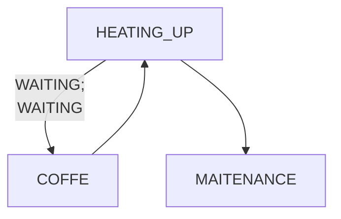

# krups-piccolo-esphome
 - ESPHome based controller for dolce gusto (krups) piccolo coffer machine
 - Control coffe machine remotely
   - Turn on/off
   - Keep track of the machine state
   - Start maitenance procedure
   - Start and stop coffe automatically
     - Short press for expresso
     - Long press for large coffe

## Control board
 

# State Machine

## Installation 
 - Install ESPHome Builder in HAOS
 - Setup ESP8266 or ESP32 board and take note of the encryption and OTA keys
 - Copy the `coffe.yaml` code to your file.
   - Replace keys
 - Compile and install.

## HA Card

 - Use `card.yaml` template to create card
 - Replace the URL to acess image files 