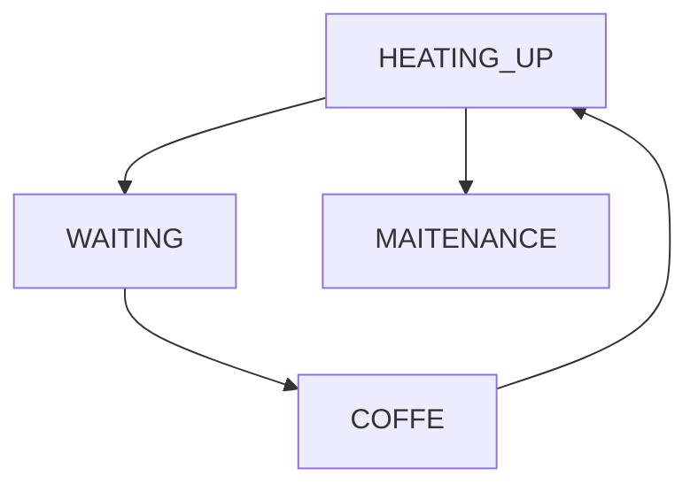

# KRUPS Piccolo ESPHome
 - ESPHome based controller for dolce gusto (krups) piccolo coffer machine
 - Control coffe machine remotely
   - Turn on/off
   - Keep track of the machine state
   - Start maitenance procedure
   - Start and stop coffe automatically
     - Short press for expresso
     - Long press for large coffe

## Material
 - Two relays (board)
   - Control pump
   - Turn on/off
 - Optocoupler PC817 board (2 inputs)
   - Status LED's
 - ESP board (code uses NodeMCU board w/ ESP8266)
 - Button (any small button will do)
   - Preferably one that can be easily attached to the machine shell

## Diagram

## Control board
 - The controlo board of the machine is nicely labeled
 - The NCT input is used for the temperature sensor
   - NTC sensor
   - Not Used for this project
 - MMI LED
 - Composed of 4 pins
    - 
   - Red LED (GND)
   - On/Off Button (Activated w/ 5V) 
   - 5V
   - Green LED (GND)
 - MMI BUT
   - Not used for this project
 - V. Det
   - Cold (Activated /w 5V)
   - 5V
   - Hot (Activated /w 5V)
 - FW
   - Enabled/disable the pump
   - Actived with a magnetic sensor when the lid closes
   - Shunted for this project

## Installation 
 - Install ESPHome Builder in HAOS
 - Setup ESP8266 or ESP32 board and take note of the encryption and OTA keys
 - Copy the `coffe.yaml` code to your file.
   - Replace keys
 - Compile and install.

## HA Card

 - Use `card.yaml` template to create card
 - Replace the URL to acess image files
 - 
